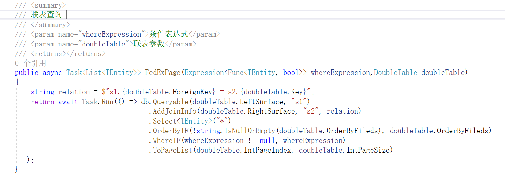
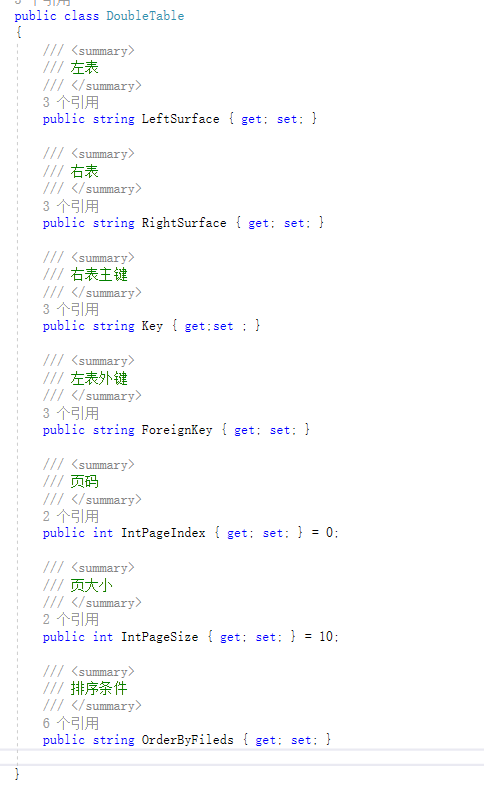
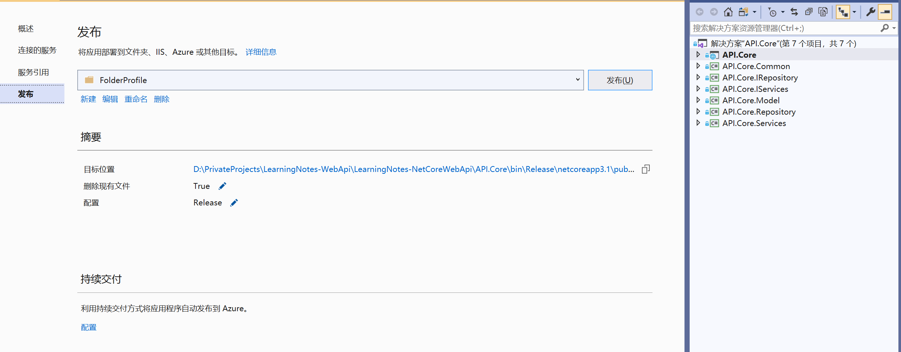
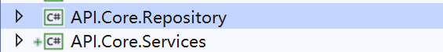
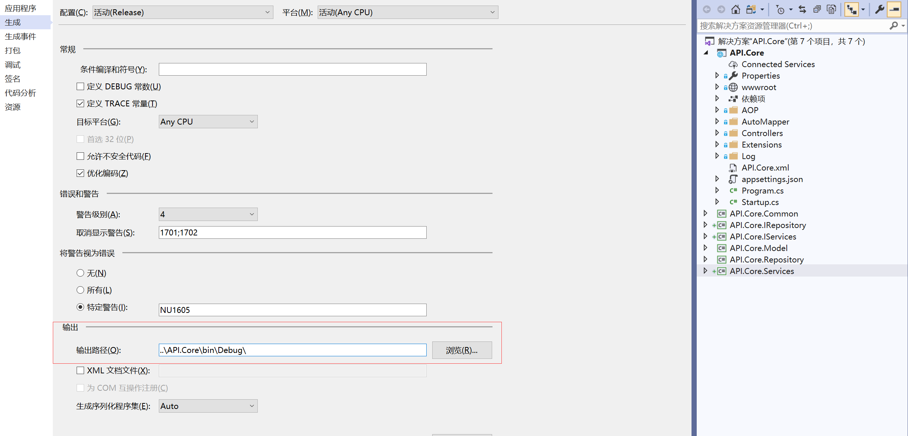

本项目在https://github.com/anjoy8/Blog.Core基础上搭建

更改部分内容：

​	1.封装多表查询（原作者只封装了单表查询）：

​	ORM 框架采用 SqlSugar 查阅文档可得知，支持动态查询（拼接Lambd或SQL）
DoubleTable 为参数实体类 包含需查询表的名称，外联表及关联参数等

DoubleTable 实体类属性如下图

发布注意！

如果直接右键属性——发布。将编译过后的文件上传到服务器上，很可能无法启动！

可能原因1：

​				Repository 与 Services 已解耦，并未在项目中依赖引用。所以需要发布时候，手动将API.Core.Services.dll 与 API.Core.Repository.dll 放入bin文件中。

本地Debug 能正常运行是因为设置了生成指定路径

注意一：

​			Dto 应该和ViewModels 区分开来。不应该直接暴露Dto ，这样既不安全 又会造成开发中的麻烦：一旦更改数据库结构，那么API对外消费者也需更改。

​		对于程序来说，数据库和Dto 是紧密结合的，这对API 和 数据各自升级照成了不便。